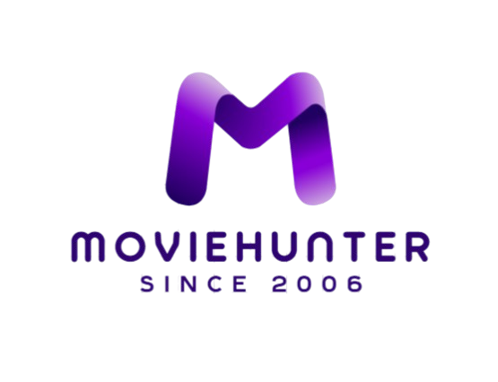

# MovieHunter

**Hunt movies. Stream free music. Download for offline.**  
A dark, cinematic entertainment app built for phones.

---

## Brand

**MovieHunter** is entertainment without the noise — purple on black, bold posters, and one clear job: get you into the next title, track, or download fast.

| | |
|---|---|
| **Primary** | `#3d0081` |
| **Secondary** | `#bd84db` |
| **Accent** | `#5a00a2` |
| **Surface** | Deep black UI |

---

## What you can do

### Movies & series

Browse trending, cinema, and coming-soon rows. Open any title for details, episodes, and playback — with quality options when you download.

### Hot Shorts

Vertical short clips you swipe through like a feed — quick watches between longer titles.

### Songs

Free full-length music (Audius). Search by song or artist, build local playlists, like tracks, and play with a full in-app player (seek, shuffle, repeat, volume).

### Downloads

Offline library in one place:

- **Movies**
- **Series**
- **Songs**

Pause, resume, and play from device storage when you’re offline.

### Always with you

- Sticky **now playing** for music  
- Background / lock-screen ready on native builds  
- Device access control for shared or private installs  
- Optional **in-app updates** from your own releases (website / GitHub — Play Store not required)

---

## Designed for the hand

- Dark-first interface  
- Poster-led home experience  
- Fast search with live suggestions  
- Skeleton loaders so the app feels instant

---

## Get the app

Sideload or download the latest APK from releases when published.

*MovieHunter — find it. Play it. Keep it.*

---

## Copyright & license

**© 2026 MovieHunter / IsmailofficialGithub. All rights reserved.**

The MovieHunter name, logos, icons, and brand identity may not be reused without permission.

Full terms: [`LICENSE`](LICENSE)

Third-party open-source libraries (Expo, React Native, and related packages) remain under their own licenses. Music via Audius and title artwork belong to their respective rights holders.
